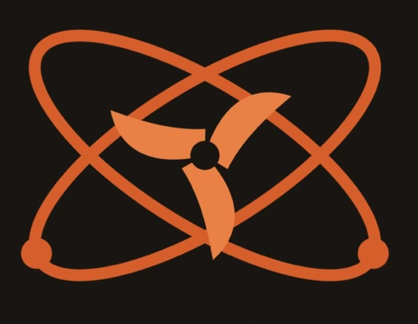

  

# ⚛ Axion

Open-source AI coding agent ecosystem by Axion Labs.

<a class="news-banner" href="/project-crucible">
  New
  <strong>Project Crucible</strong> — TAME architecture R&D sprint: ternary MoE, MTP, GQA. See the day-3 status →
</a>

<a class="news-banner" href="/lumen-125-safety">
  Release
  <strong>Lumen 1.2.5</strong> — safety-tested, free in the browser and CLI. See the full safety report →
</a>

  <a href="https://github.com/AxionLabsAI/axion">GitHub Repository</a>
  <a href="/announcements">Announcements</a>
  <a href="/lumen-125-safety">Lumen 1.2.5 Safety Report</a>
  <a href="/privacy">Privacy Policy</a>

